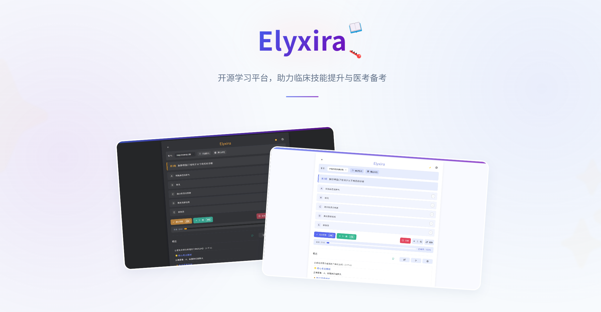

<div align="center">

# Elyxira - 开源学习平台

一个使用 Vue 3、TypeScript 和 Vite 构建的现代化学习平台，提供刷题、笔记、工具等功能。


</div>

<div align="center">
<p>🌟 样式美观 • 开源透明 • 在线刷题 • AI助力 🌟</p>
<p><i>基于HTML的智能题目练习平台，支持AI解析与自定义题库</i></p>
</div>

---

## ✨ 特色功能

<table>
  <tr>
    <td><b>🤖 智能解析</b></td>
    <td>基于AI的个性化学习解析，精准定位薄弱环节</td>
  </tr>
  <tr>
    <td><b>📝 笔记系统</b></td>
    <td>支持Markdown格式，结合AI助手整理学习要点</td>
  </tr>
  <tr>
    <td><b>☁️ 数据同步</b></td>
    <td>GitHub远程仓库同步，学习进度随时随地可访问</td>
  </tr>
  <tr>
    <td><b>🔌 离线使用</b></td>
    <td>本地存储学习数据，无网络环境也能高效学习</td>
  </tr>
  <tr>
    <td><b>🌓 双主题</b></td>
    <td>明亮/暗黑模式自由切换，呵护视力健康</td>
  </tr>
  <tr>
    <td><b>📊 学习统计</b></td>
    <td>详细记录学习情况，追踪正确率与知识点掌握程度</td>
  </tr>
  <tr>
    <td><b>⭐ 错题收藏</b></td>
    <td>自动整理易错题目，形成针对性复习计划</td>
  </tr>
</table>

## 🚀 快速开始

### 三步上手

1. 访问 [Elyxira官网](https://elyxira.github.io) 进入应用
2. 导入题库或选择预设题库开始学习
3. _可选_：启用GitHub授权开启云端数据同步

## 💻 本地部署

```bash
# 克隆仓库
git clone https://github.com/yokuminto/elyxira.git

# 进入项目目录
cd elyxira

# 使用任意HTTP服务器运行
# 例如使用Python内置服务器
python -m http.server 8080

# 浏览器访问: http://localhost:8080
```

## 📱 设备兼容性

<div align="center">

|  设备类型   | 兼容状态 |          备注           |
| :---------: | :------: | :---------------------: |
|  💻 桌面端  |    ✅    | Windows / macOS / Linux |
|  📱 移动端  |    ✅    |      iOS / Android      |
| 📟 平板设备 |    ✅    |        全面支持         |

</div>

## ⚙️ 自定义设置

Elyxira提供多种个性化配置选项：

- **AI接口设置** - 支持多种LLM模型接入
- **GitHub同步配置** - 云端备份与多设备同步
- **学习偏好设置** - 自定义学习计划与提醒
- **界面主题定制** - 个性化视觉体验
- **数据导入导出** - 灵活管理学习资源

## 📚 题库格式支持

Elyxira目前支持单选题类型，兼容两种主要导入格式：

### 1️⃣ JSON格式（标准格式）

```json
{
  "chapters": [
    {
      "title": "章节名称",
      "questions": [
        {
          "question": "题目内容",
          "options": ["选项A", "选项B", "选项C", "选项D"],
          "answer": "B",
          "notes": "解析内容"
        }
      ]
    }
  ]
}
```

### 2️⃣ TXT格式（简易格式）

```
一、三基知识总论 (格式："序号、章节名"，可选)
一、单选题xxxx（使用章节名时必须在后方换行增加格式："序号、单选题"，后面可接乱码，不影响）
1. 题目内容
A. 选项A
B. 选项B
C. 选项C
D. 选项D
E. 选项E
答案: B（也支持"标准答案"、"正确答案"）

2. 下一道题目
...
```

## 🔄 云端同步设置

1. 在设置中配置GitHub仓库信息
2. 授权访问令牌 (Personal Access Token)
3. 设置同步路径和分支
4. 选择自动同步或手动同步模式

## 🤝 参与贡献

我们欢迎各种形式的贡献！特别是：

- 📚 题库资源扩充与优化
- 🎨 界面与用户体验改进
- ✨ 新功能开发与创意
- 🌍 文档翻译与国际化
- 🐛 问题修复与代码优化

**贡献步骤**：Fork → 修改 → 提交PR

## 📜 开源协议

本项目采用双协议授权：
采用 [MIT 协议](LICENSE-MIT.md) + [CC BY-NC-SA 4.0 国际许可协议](LICENSE-CC.md)

  <a href="https://creativecommons.org/licenses/by-nc-sa/4.0/deed.zh">
    
  </a>

## 🙏 鸣谢

  <p>感谢所有为医学教育做出贡献的教育工作者</p>
  <p>感谢东方医学社群提供的支持</p>
  <p>感谢参与测试和反馈的所有用户</p>

---

<div align="center">
<a href="https://thfmu.com/" title="东方医学">
  
</a>
  <br><b>欢迎来到东方医学(THMED)！</b><br>
  东方医学致力于医学病案交流、循证体系建构与文化传播<br>
  提供东方世界观作品与医学专业课的交流平台<br>
  我们希望您在这里度过一段美好的时光～
</div>

## 项目特点

- 📝 刷题模块：支持多种刷题模式，包括随机、顺序、错题练习等
- 📒 笔记模块：支持 Markdown 编辑和预览
- 🔧 工具模块：提供多种实用工具，如单位转换、BMI 计算器等
- ⚙️ 设置模块：可自定义 AI 助手和仓库配置

## 技术栈

- **前端框架**：Vue 3
- **状态管理**：Pinia
- **路由管理**：Vue Router
- **类型系统**：TypeScript
- **构建工具**：Vite
- **CSS 预处理器**：无（使用原生 CSS 变量）
- **UI 组件**：自定义组件

## 项目结构

项目采用模块化的结构组织代码：

```
src/
├── assets/             # 静态资源
│   ├── icons/          # SVG 图标
│   ├── images/         # 图片资源
│   └── fonts/          # 字体文件
├── components/         # 全局通用组件
│   ├── common/         # 基础组件（按钮、输入框等）
│   ├── layout/         # 布局组件
│   └── modals/         # 弹窗组件
├── composables/        # 组合式函数
├── constants/          # 常量定义
├── modules/            # 按业务模块分组
│   ├── quiz/           # 测验模块
│   ├── notes/          # 笔记模块
│   ├── tools/          # 工具模块
│   └── settings/       # 设置模块
├── router/             # 路由配置
├── stores/             # Pinia 状态管理
├── styles/             # 全局样式
│   ├── variables.css   # CSS 变量
│   ├── reset.css       # 重置样式
│   ├── themes/         # 主题样式
│   └── components/     # 组件通用样式
├── types/              # 全局类型定义
├── utils/              # 工具函数
├── App.vue             # 根组件
└── main.ts             # 入口文件
```

## 模块说明

### Quiz 模块

测验模块提供了刷题功能，支持以下特性：

- 多种刷题模式（正常、复习、随机、范围）
- 错题记录与练习
- 章节选择
- 进度保存
- 远程仓库同步

### Notes 模块

笔记模块提供了笔记管理功能，支持以下特性：

- Markdown 编辑与预览
- 笔记分类
- 笔记搜索
- 笔记导出/导入

### Tools 模块

工具模块提供了多种实用工具，包括：

- 单位转换器
- BMI 计算器
- 随机生成器
- 专注计时器

### Settings 模块

设置模块提供了应用配置功能，包括：

- AI 助手配置
- 远程仓库配置
- 主题切换
- 其他全局设置

## 开发指南

### 安装依赖

```bash
npm install
```

### 启动开发服务器

```bash
npm run dev
```

### 构建生产版本

```bash
npm run build
```

### 运行测试

```bash
npm run test
```

## 贡献指南

欢迎贡献代码，请遵循以下步骤：

1. Fork 本仓库
2. 创建新分支 (`git checkout -b feature/awesome-feature`)
3. 提交更改 (`git commit -m 'Add awesome feature'`)
4. 推送到分支 (`git push origin feature/awesome-feature`)
5. 创建 Pull Request

## 许可证

[MIT 许可证](LICENSE)
