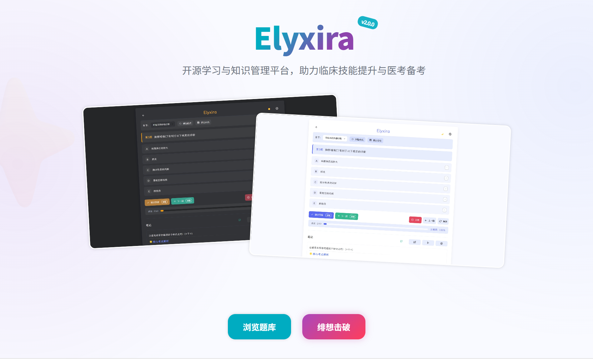

<div align="center">

# Elyxira


</div>

<div align="center">
<p><i>基于 Vue 3 + Vite 的智能医学刷题平台，支持 AI 知识点精讲、绯想击破游戏化模式、GitHub 云端同步</i></p>
</div>

---

## ✨ 特色功能

| 功能 | 说明 |
|------|------|
| 🤖 **AI 知识点精讲** | 爱莉希雅教授三模式分层教学（精简/中间/完整），正向临床推演 + 四色法则着色 |
| 📝 **笔记系统** | Markdown 笔记 + AI 一键生成，支持编辑、题目标签分类、诊断公式/口诀速记 |
| ⚔️ **绯想击破** | HSR 风格肉鸽刷题，27 节点 × 3 层，8 角色 × 3 羁绊组，商店/Boss/补给站 |
| ☁️ **GitHub 同步** | 题库、笔记、标签云端同步，支持跨设备配置导入导出，Git Data API 批量推送 |
| 📊 **学习统计** | 答题次数、正确率追踪，每道题独立统计 |
| 🌓 **个性化显示** | 可调节字号、字体，动画与音效开关 |

---

## 🚀 快速开始

1. 访问 [Elyxira](https://elyxira.github.io) 进入应用
2. 导入题库或选择预设题库开始学习
3. 可选：配置 GitHub 仓库开启云端同步

## 💻 本地部署

```bash
git clone https://github.com/elyxira/Elyxira.git
cd Elyxira
npm install
npm run dev      # 开发模式
npm run build    # 生产构建
```

## ⚙️ 自定义设置

- **AI 接口设置** — 支持 OpenAI 兼容 API，可配置模型、温度、系统提示词
- **GitHub 同步** — 题库拉取/推送，绯想击破笔记/标签云端存储
- **显示与音效** — 字体大小、字体选择、动画开关、音效音量
- **数据导入导出** — 一键导出全部配置和笔记，跨设备迁移

## 📚 题库格式

### JSON 格式

```json
{
  "chapters": [
    {
      "title": "章节名称",
      "questions": [
        {
          "question": "题目内容",
          "options": ["选项A", "选项B", "选项C", "选项D"],
          "answer": "B",
          "notes": "解析内容"
        }
      ]
    }
  ]
}
```

### TXT 格式

```
一、章节名
1. 题目内容
A. 选项A
B. 选项B
C. 选项C
D. 选项D
答案: B
```

## 🤝 参与贡献

欢迎各种形式的贡献：题库扩充、功能开发、问题修复、文档改进。

**贡献步骤**：Fork → 修改 → 提交 PR

## 📜 开源协议

本项目采用 [MIT 协议](LICENSE.md) 授权。

---

<div align="center">
<a href="https://thfmu.com/" title="东方医学">
  
</a>
  <br><b>欢迎来到东方医学(THMED)！</b><br>
  东方医学致力于医学病案交流、循证体系建构与文化传播<br>
  提供东方世界观作品与医学专业课的交流平台<br>
  我们希望您在这里度过一段美好的时光～
</div>
